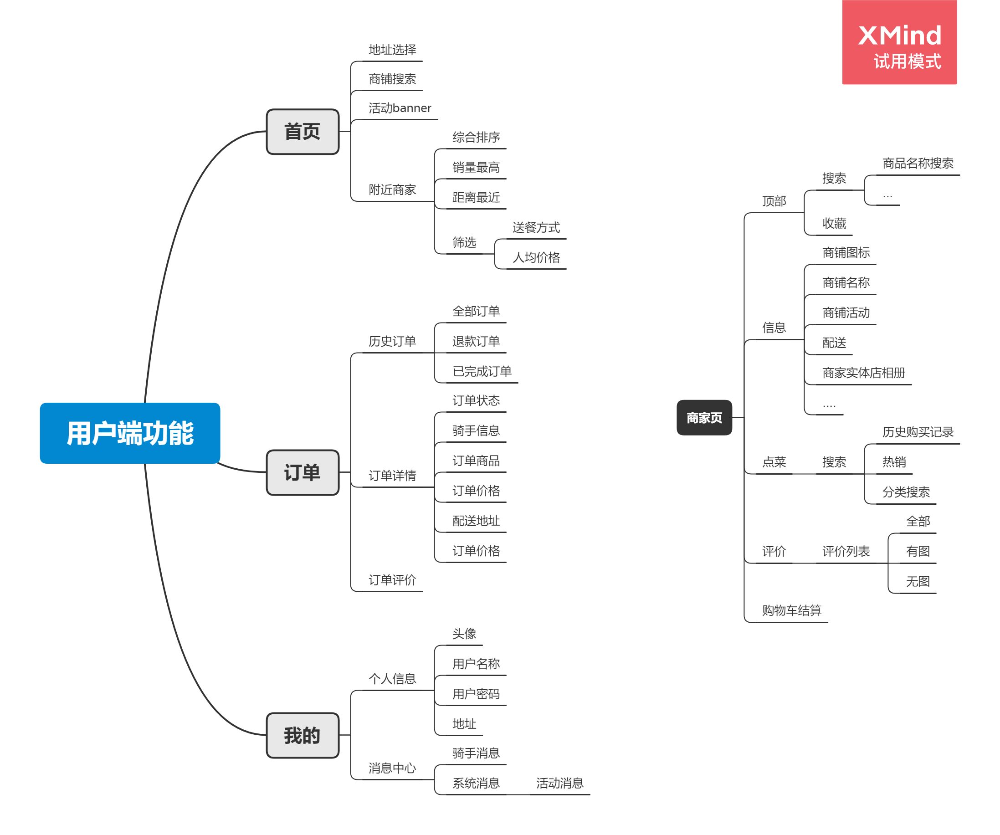

## Introduction

Hey，Welcome to the [Quick-Spring-Boot](https://github.com/quick-spring-boot) Open Source organization. 

Our organization is around the takeaway project as a goal.

## link

- GitHub : https://github.com/SourceHot

## Owner

[HuiFer](https://github.com/huifer)

- Email: [huifer97@163.com](mailto:huifer97@163.com)
- GitHub: https://github.com/huifer

## Projects

| #    | name             | desc                              | url                                                   |
| ---- | ---------------- | --------------------------------- | ----------------------------------------------------- |
| 1    | manage-project   | Delivery management server system | https://github.com/quick-spring-boot/manage-project   |
| 2    | consumer-project | Take out small pack server system | https://github.com/quick-spring-boot/consumer-project |
| 3    | business-project | Takeout merchant server system    | https://github.com/quick-spring-boot/business-project |

## Gitter

We have opened a number of chat rooms. If you want to know the project information with the members of the organization, you can add them. 

- Main: 
- manage-project: 
- consumer-project: 
- business-project: 

## How to join

- Communicate directly on the [issues](https://github.com/quick-spring-boot/quick-spring-boot.github.io/issues/1) of this project.
- Send an email to [huifer97@163.com] and attach your GitHub ID, such as [huifer](https://github.com/huifer).

## goal

